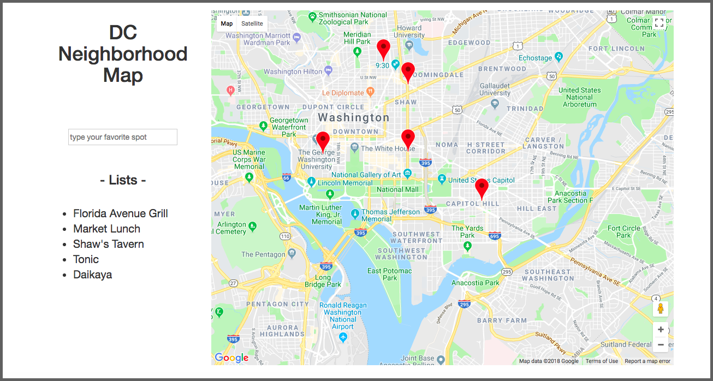

# Neighborhood-Map Project

### About the project

* This is Project 5 in Frond-End Developer Nanodegree program from Udacity.
* The project is featuring a map of my favorite restaurants in Washington DC.
* Users can learn the restaurants' names, locations, streetviews, and ratings by one click.
* Type restaurant's name in the blank or click markers.

### How to run

* Clone this repository.
* Open index.html (Using Chrome is recommended)
* Or click [here](https://hyojinsarchet.github.io/Neighborhood-Map/)

### Built with

|      Tools      |
| :-------------: |
|   JavaScript    |
|      Html       |
|       CSS       |
|     jQuery      |
|    Bootstrap    |
|    Knockout     |
| Google Maps API |
| FourSquare API  |

### The main page look

